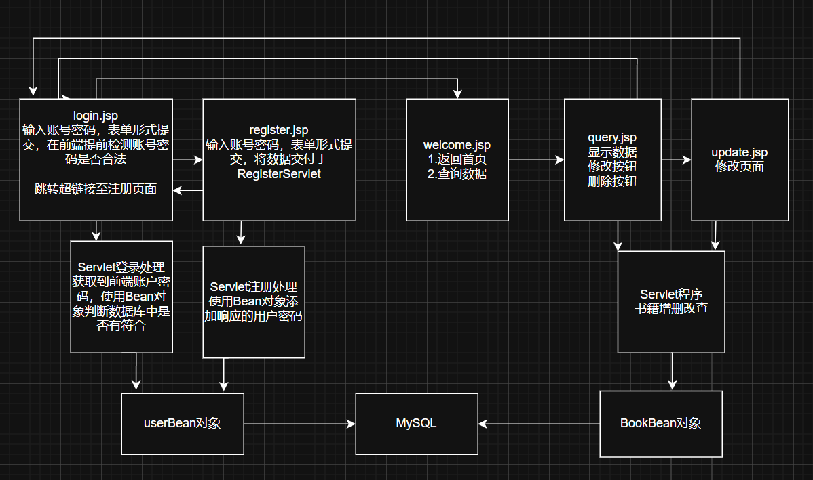

# Java Web的领域数据管理系统

是网络编程的第二次大作业，非常的简陋，而且没有做异常处理，全当水作业了

远程仓库地址：https://github.com/thrinisty/BookManager.git

## 一、目的

1．熟悉Java Web的基本功能和使用方法。

2．掌握如何使用JSP、JavaBean、Servlet等进行Web应用程序开发。

3．学习Java Web网络编程的分析与设计方法。


## 二、环境

1．PC一台。

2．IDEA编程软件


## 三、要求

使用Java Web，设计与实现一个领域数据管理系统，要求使用实现特定领域数据的在线访问、显示及数据管理，在实验中完成需求获取、系统分析、系统设计各阶段的基本任务。

#### 任务一：（已实现）

设计与实现一个基于JSP+Servlet+JavaBean的领域数据管理系统，要求支持：

1）支持用户注册与登录模块；

2）支持特定领域数据的在线访问、可视化展示；

3）支持特定领域数据的增、删、改、查操作；

4）支持使用Mysql数据库对领域数据进行存储管理；

5）开发的系统利用Tomcat进行部署应用。

#### 任务二：（框架还在学习中，任务二尚未完成）

在任务一的基础上选做。使用Java Web相关开发框架，设计实现更加复杂的领域数据管理功能模块，实现较友好美观的前端Web界面，提升持久化数据管理以及系统运行性能。


## 四、步骤

1.分析领域数据管理程序的需求，绘制流程图，设计Web系统。

设计一个图书馆的管理系统，允许登录用户进行对于书本数据库的增删改查

流程图：



2.分析主要功能的实现，利用JSP进行系统开发。

实现登录注册功能（通过过滤器Filter完成）

实现在线访问（通过JSP页面显示）

支持数据的增删改查（Servlet+BeanDao）

支持数据库存储（MySQL）


3.学习MVC设计模式，采取层次化设计模型，设计领域数据管理功能。

工程通过JSP+Servlet+BasicDao构建层次化设计模式，完成响应功能


4.完成任务一

### 过滤器

通过过滤没有登录的用户，禁止其访问admin文件夹下的资源

```java
@WebFilter("/admin/*")
public class LoginFilter implements Filter {
    @Override
    public void init(FilterConfig filterConfig) throws ServletException {
        Filter.super.init(filterConfig);
    }

    @Override
    public void destroy() {
        Filter.super.destroy();
    }

    @Override
    public void doFilter(ServletRequest servletRequest, ServletResponse servletResponse, FilterChain filterChain) throws IOException, ServletException {
        HttpServletRequest request = (HttpServletRequest) servletRequest;
        HttpSession session = request.getSession();
        Object user = session.getAttribute("user");
        if (user == null) {
            servletRequest.getRequestDispatcher("/login.jsp").forward(servletRequest, servletResponse);
            return;
        } else {
            filterChain.doFilter(servletRequest, servletResponse);
        }
    }
}
```


### BasicDao

```java
package com.bean;

import org.apache.commons.dbutils.QueryRunner;
import org.apache.commons.dbutils.handlers.BeanHandler;
import org.apache.commons.dbutils.handlers.BeanListHandler;
import org.apache.commons.dbutils.handlers.ScalarHandler;

import java.sql.Connection;
import java.util.List;

public class BasicDao<T> {//使用泛型指定具体类型
    private QueryRunner qr = new QueryRunner();

    //开发通用的dml方法，针对任意的表
    public int update(String sql, Object... parameters) {
        Connection connection = null;
        try {
            connection = JDBCUtilsDruid.getConnection();
            return qr.update(connection, sql, parameters);
            //返回受影响的行数，执行语句
        } catch (Exception e) {
            throw new RuntimeException(e);
        } finally {
            JDBCUtilsDruid.close(null, null, connection);
        }
    }

    //返回对个查询对象
    public List<T> queryMulti(String sql, Class<T> cls, Object... parameters) {
        Connection connection = null;
        try {
            connection = JDBCUtilsDruid.getConnection();
            return qr.query(connection, sql, new BeanListHandler<T>(cls), parameters);
        } catch (Exception e) {
            throw new RuntimeException(e);
        } finally {
            JDBCUtilsDruid.close(null, null, connection);
        }
    }

    //返回查询单行结果
    public T querySingle(String sql, Class<T> cls, Object... parameters) {
        Connection connection = null;
        try {
            connection = JDBCUtilsDruid.getConnection();
            return qr.query(connection, sql, new BeanHandler<T>(cls), parameters);
        } catch (Exception e) {
            throw new RuntimeException(e);
        } finally {
            JDBCUtilsDruid.close(null, null, connection);
        }
    }

    //查询单行单列的方法
    public Object queryScalar(String sql, Object... parameters) {
        Connection connection = null;
        try {
            connection = JDBCUtilsDruid.getConnection();
            return qr.query(connection, sql, new ScalarHandler(), parameters);
        } catch (Exception e) {
            throw new RuntimeException(e);
        } finally {
            JDBCUtilsDruid.close(null, null, connection);
        }
    }
}
```


### Druid连接池

```java
package com.bean;
import com.alibaba.druid.pool.DruidDataSourceFactory;
import javax.sql.DataSource;
import java.io.FileInputStream;
import java.io.IOException;
import java.io.InputStream;
import java.sql.Connection;
import java.sql.ResultSet;
import java.sql.SQLException;
import java.sql.Statement;
import java.util.Properties;

public class JDBCUtilsDruid {
    private static DataSource ds;

    static {
        Properties properties = new Properties();
        InputStream input;
        input = JDBCUtilsDruid.class.getClassLoader().getResourceAsStream("config.properties");
        try {
            if (input == null) {
                throw new RuntimeException("无法找到配置文件 config.properties");
            }
            properties.load(input);
            ds = DruidDataSourceFactory.createDataSource(properties);
        } catch (Exception e) {
            throw new RuntimeException("初始化数据库连接池失败", e);
        } finally {
            try {
                if (input != null) {
                    input.close();
                }
            } catch (IOException e) {
                System.out.println("关闭失败");
            }
        }
    }

    public static Connection getConnection() {
        try {
            return ds.getConnection();
        } catch (SQLException e) {
            throw new RuntimeException(e);
        }
    }

    public static void close(ResultSet result, Statement statement, Connection connection) {
        try {
            if (result != null) {
                result.close();
            }
            if (statement != null) {
                statement.close();
            }
            if (connection != null) {
                connection.close();
            }
        } catch (SQLException e) {
            throw new RuntimeException(e);
        }
    }
}
```


Book对象与User对象

```java
public class Book {
    private int id;
    private String title;
    private String author;
    private double price;
	//省略各种构造器以及方法
}
```

```java
public class User {
    private String username;
    private String password;
    //省略各种构造器以及方法
}
```


### Servlet处理程序

这里以查询为例

```java
@WebServlet("/query")
public class Query extends HttpServlet {
    @Override
    protected void doGet(HttpServletRequest req, HttpServletResponse resp) throws ServletException, IOException {
        BookDao bookDao = new BookDao();
        String sql = "select * from book";
        List<Book> books = bookDao.queryMulti(sql, Book.class);
        // 将数据存入request属性
        req.setAttribute("books", books);
        // 转发到JSP页面
        req.getRequestDispatcher("/admin/query.jsp").forward(req, resp);
    }
}
```


### JSP前端设计

由于MVC的设计模式，前端很少实现响应的数据功能，只负责View显示，由大模型可以高效生成美观的的JSP页面，

只需要在各个JSP页面跳转之间进行设计，访问的Servlet程序功能按钮，以及从Request域中获取响应的数据即可，这里以change.jsp为例

```html
<h1>Add New Book</h1>

<form action="../insert" method="get">
  <div class="form-group">
    <label for="id">Book ID:</label>
    <input type="text" id="id" name="id" required>
  </div>

  <div class="form-group">
    <label for="name">Book Name:</label>
    <input type="text" id="name" name="name" required>
  </div>

  <div class="form-group">
    <label for="author">Author:</label>
    <input type="text" id="author" name="author" required>
  </div>

  <div class="form-group">
    <label for="price">Price:</label>
    <input type="number" id="price" name="price" step="0.01" min="0" required>
  </div>

  <button type="submit" class="submit-btn">Add Book</button>
</form>
```


5.分析实验，总结实验心得，撰写报告。

实验综合性较强，可以很好的巩固JavaWeb的各个知识点，这一次实验完成了一个简易的书籍管理系统，

但是在异常处理方面上较为简陋，没有很好的处理SQL语句报错的异常处理，直接捕获抛出

而且还是有很多的地方可以进行改进，例如在获取数据的时候其实可以通过Ajax请求访问，局部更新数据来实现更好的运行效率以及用户体验