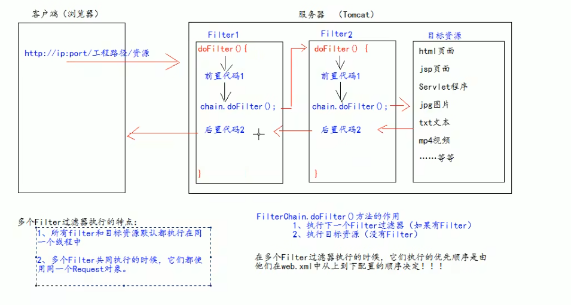

# JavaWeb笔记

## Filter

:::note

- 过滤器：是JavaWeb的三大组件之一（Servlet，Listener，Filter）
- 过滤器是JavaEE的规范，也就是接口
- Filter过滤器作用是：拦截请求，过滤响应

:::

### 基本使用

#### JSP页面实现

要求web工程下有一个admin目录，这个admin目录下的所有资源都要求登录后才可以使用

根据之前的情况分析，我们需要将登陆的信息存储在Cookie中，如果其中的键user值为null，则没有登陆，跳转至登录页面，而又user信息，则跳转至目标资源

```html
<%@ page contentType="text/html;charset=UTF-8" language="java" %>
<html>
<head>
    <title>Index</title>
</head>
<body>
<%
    Object user = session.getAttribute("user");
    if (user == null) {
        request.getRequestDispatcher("/login.jsp").forward(request,response);
        return;
    }
%>
</body>
</html>
```

但是这样一种方式是有局限性的，没有办法跳到图片，html页面，而且当直接用对应的路径访问也可以访问到权限资源，我们这个时候就可以使用Filter过滤器来完成


#### Filter实现

:::note

使用步骤：

1.我们创建一个继承于import javax.servlet.Filter的过滤器类

2.实现拦截方法doFilter

3.配置拦截路径

:::

```java
package com.filter;

import javax.servlet.*;
import javax.servlet.annotation.WebFilter;
import javax.servlet.http.HttpServletRequest;
import javax.servlet.http.HttpSession;
import java.io.IOException;

@WebFilter("/admin/*")//配置拦截路径
public class AdminFilter implements Filter {
    @Override
    public void doFilter(ServletRequest servletRequest, ServletResponse servletResponse, FilterChain filterChain) throws IOException, ServletException {
        HttpServletRequest request = (HttpServletRequest) servletRequest;
        HttpSession session = request.getSession();
        Object user = session.getAttribute("user");
        if (user == null) {
            servletRequest.getRequestDispatcher("/login.jsp").forward(servletRequest, servletResponse);
            return;
        } else {
            //让程序继续向下访问目标资源
            filterChain.doFilter(servletRequest, servletResponse);
        }
    }

    @Override
    public void destroy() {
        Filter.super.destroy();
    }

    @Override
    public void init(FilterConfig filterConfig) throws ServletException {
        Filter.super.init(filterConfig);
    }
}
```

这样做就会拦截Session中user为空的客户端访问

我们成功登录的逻辑通过Servlet完成，当成功将session域的user设置对应的用户名，当Session的user非空即可访问被拦截限制的资源

登录JSP界面

```html
<form action="http://localhost:8080/Fliter/login" method="get">
    用户名称<input type="text" name="username" value="${cookie.username.value}"><br/>
    密码<input type="password" name="password" value="${cookie.password.value}"><br/>
    <input type="submit" value="Submit">
</form>
```

登录Servlet

```java
@WebServlet("/login")
public class Login extends HttpServlet {
    @Override
    protected void doGet(HttpServletRequest req, HttpServletResponse resp) throws ServletException, IOException {
        System.out.println("doGet");
        resp.setContentType("text/html;charset=UTF-8");
        HttpSession session = req.getSession();
        String username = req.getParameter("username");
        String password = req.getParameter("password");
        if(username.equals("admin") && password.equals("123456")){
            System.out.println("login success");
            session.setAttribute("user", username);
            resp.getWriter().write("<h1>Login Success</h1>");
        } else {
            System.out.println("login failed");
            req.getRequestDispatcher("/login.jsp").forward(req, resp);
        }
    }
}
```


### 生命周期

Filter的生命周期包含几个方法：1.构造器方法 2.nit初始化方法  3.doFilter方法  4.destory销毁方法

在Web工程启动的时候，1、2两部就已经被执行（Filter被创建）

当在访问被拦截资源的时候的时候，调用3方法（每次）

当停止Web工程的时候执行


### FilterConfig类

是Filter过滤器的配置文件类

Tomcat每次创建Filter的时候，同时也会创建一个FilterConfig类，包含了Filter配置文件的配置信息

:::note

作用：获取filter过滤器的配置内容

1.获取Filter的名称 filter-name内容

2.获取Filter中配置init-param初始化参数

3.获取ServletContext对象

:::

运用注解设置过滤器的名称初始化参数的设置

```java
@WebFilter(
        filterName = "myFilter",
        urlPatterns = {"/admin/*"},
        initParams = {
                @WebInitParam(name = "param1", value = "value1"),
                @WebInitParam(name = "param2", value = "value2")
        }
)
```


获取过滤器名称以及初始化参数

```java
public void init(FilterConfig filterConfig) throws ServletException {
    System.out.println(filterConfig.getFilterName());//myFilter
    System.out.println(filterConfig.getInitParameter("param1"));//value1
    System.out.println(filterConfig.getInitParameter("param2"));//value2
    Filter.super.init(filterConfig);
}
```


### Filter拦截路径

:::note

有三种匹配方式，Filter只关心请求的地址是否匹配，不关心资源存在

:::

#### 精确匹配

请求地址必须为 http://localhost:8080/path/admin/1.jsp

```
"/admin/1.jsp"
```

#### 目录匹配

对应目录下的所有资源

```
"/admin/*"
```

#### 后缀名匹配

请求地址必须以.html结尾

```
"*.html"
```


### FilterChain过滤器链

FilterChain：多个过滤器如何一起工作


