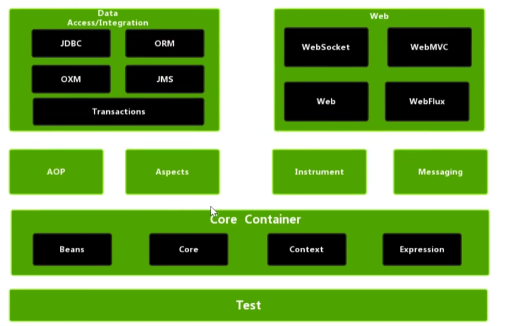

# Spring笔记

Spring6框架的学习，我本来使用的是尚硅谷23年的Spring6课程，但是这套课程看了几集发现讲的有些无趣，没有去深入的挖掘一些方法的实现，也没有讲清楚为什么要使用Spring框架来进行开发，优势在哪里，下午发现了动力节点的Spring课程（21h），现在开始学习，预计8天完成

<iframe 
    width="100%" 
    height="468" 
    src="//player.bilibili.com/player.html?bvid=BV1Ft4y1g7Fb&p=1&autoplay=false" 
    scrolling="no" 
    border="0" 
    frameborder="no" 
    framespacing="0" 
    allowfullscreen="true">
</iframe>

## Spring

:::note

Spring框架是一款轻量级（不需要依赖于其他的组件）的开源框架，解决了企业应用开发的复杂性，除了自己提供功能外，还提供整合其他技术和框架的能力

广义上：Spring泛指以Spring Framework为核心的Spring技术栈

狭义上：Spring特指Spring Framework，通常称为Spring框架

:::




## IoC与AOP

Spring有两个核心的模块：IoC和AOP

Inverse of Control：译为“控制反转”，指把创建的对象过程交给Spring进行管理

Aspect Oriented Programming：译为“面向切面的编程”，AOP用来封装多个类的公共行为，将那些与业务无关，却为业务模块所共同调用的逻辑封装起来，减少系统的重复代码，降低模块间的耦合度，另外，AOP还解决一些系统层面上的问题，如日志，事务，权限等。


## 入门示例

**通过Spring创建对象**

:::tip

1. 引入spring相关依赖
2. 创建类，定义属性和方法
3. 按照spring要求创建xml配置文件
4. 在配置文件中配置相关信息

:::

### 引入相关依赖

#### springframework

```html
<dependency>
    <groupId>org.springframework</groupId>
    <artifactId>spring-context</artifactId>
    <version>6.1.14</version>
</dependency>
```

:::tips

1. 通过 `@Component` 声明组件
2. 用 `@Autowired` 自动注入依赖
3. 使用 `@Configuration` 定义配置类
4. 通过 `ApplicationContext` 获取和管理 Bean

:::


#### JUnit依赖

```html
<!-- JUnit Jupiter API (测试编写) -->
<dependency>
    <groupId>org.junit.jupiter</groupId>
    <artifactId>junit-jupiter-api</artifactId>
    <version>5.3.1</version>
    <scope>test</scope>
</dependency>

<!-- JUnit Jupiter Engine (测试执行) -->
<dependency>
    <groupId>org.junit.jupiter</groupId>
    <artifactId>junit-jupiter-engine</artifactId>
    <version>5.3.1</version>
    <scope>test</scope>
</dependency>
```


### 建立Spring配置文件

定义一个User类

```java
package com.spring6;
public class User {
    public void add() {
        System.out.println("add");
    }
}
```


### xml配置文件

按照spring要求创建配置xml文件

在配置文件中进行对于User实例的创建

id：唯一标识

class：创建对象的全路径

```html
<?xml version="1.0" encoding="UTF-8"?>
<beans xmlns="http://www.springframework.org/schema/beans"
       xmlns:xsi="http://www.w3.org/2001/XMLSchema-instance"
       xsi:schemaLocation="http://www.springframework.org/schema/beans http://www.springframework.org/schema/beans/spring-beans.xsd">
    <bean id="user" class="com.spring6.User"></bean>
</beans>
```


### 进行测试

```java
public class TestUser {
    @Test
    public void testUserObject() {
        //加载spring配置文件，对象创建
        ApplicationContext context =
                new ClassPathXmlApplicationContext("bean.xml");

        //获取创建的对象
        User user = (User)context.getBean("user");
        System.out.println(user);//com.spring6.User@51bd8b5c

        //使用对象调用方法进行测试
        user.add();//add
    }
}
```

可以正常创建对象实例（反射）并且调用


## 引入Spring

### OCP开闭原则

是软件开发原则中最基本的一个原则：开闭原则

对于拓展开放，对于修改关闭

在拓展扩展系统功能的时候，没有修改以前写完的代码，就是符合OCP原则，如果修改了之前稳定的程序，修改了之前的程序，之前的程序都需要重新测试，非常麻烦

例如我们使用接口操作Dao对象的具体实现类，添加了一个新的Dao实现类，我们任然需要在调用Dao对象的程序中将原先的实例程序进行修改，违反了OCP原则

```java
public interface UserDao {
    void deleteUser();
}
```

```java
public class UserDaoImplForMySQL implements UserDao {
    @Override
    public void deleteUser() {
        System.out.println("数据操作层");
        System.out.println("Delete User");
    }
}
```

```java
public class UserServiceImpl implements UserService {
    private UserDao userDao = new UserDaoImplForMySQL();
    //这里需要修改
    //private UserDao userDao = new UserDaoImplForNoSQL();
    @Override
    public void deleteRequest() {
        System.out.println("业务层");
        userDao.deleteUser();
    }
}
```


### DIP依赖倒置原则

定义：上层不再调用下层

核心：面向抽象编程，接口编程，不面向具体编程

视图层调用了服务层，服务层调用了数据操作层

上层的层级因为需要调用下层的对象以及方法，依赖于下层，违背了依赖倒置原则

**上层Service**

```java
public class UserServiceImpl implements UserService {
    private UserDao userDao = new UserDaoImplForMySQL();
    //这里使用了具体的下层方法 UserDaoImplForMySQL 存在依赖
    @Override
    public void deleteRequest() {
        System.out.println("业务层");
        userDao.deleteUser();
    }
}
```

**下层Dao**

```java
public class UserDaoImplForMySQL implements UserDao {
    @Override
    public void deleteUser() {
        System.out.println("数据操作层");
        System.out.println("Delete User");
    }
}
```

我们需要解决以上的两个问题，我们需要删除用new创建的对象，将对象的创建维护的权利交付出去，这也就是我们所谓的控制反转


### IoC控制反转

反转的是：不在程序中采用硬编码的方式new对象，不在程序中采用硬编码的方式维护对象的关系

```java
public class UserAction {
    private UserService userService;//不再创建对象
    @Test
    public void deleteAction() {
        System.out.println("显示层");
        userService.deleteRequest();
    }
}
```

```java
public class UserServiceImpl implements UserService {
    private UserDao userDao;//不再创建对象
    @Override
    public void deleteRequest() {
        System.out.println("业务层");
        userDao.deleteUser();
    }
}
```

这时候代码不能运行（因为对象间的关系没有建立，会发生空指针异常），我们还需要把创建的对象过程和对象间的关系交给Spring进行管理（依赖注入Dependency Injection 是控制反转的实现）

依赖是两个对象之间的关系，而注入是一种手段可以产生对象关系

可以通过构造方法注入（通过构造方法设置接口值），或者Set方法注入（通过Set方法设置接口值）


## Spring中的八大模块


其中的Spring Core是Spring最为核心的模块，所有的模块都是基于Spring Core开发的，而AOP是次核心的，剩余6个模块都是基于AOP + Spring Core的

SSM三大框架：Spring SpringMVC MyBatis

Spring Web模块：可以集成例如Struts，WebWork等MVC框架

Spring Dao：通过Spring进行对于数据库的增删改查

Spring ORM：可以集成常见的ORM持久层框架（MyBatis）
